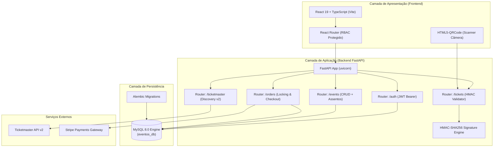

# TicketOn — Plataforma de Gestão de Eventos e Ingressos

> Sistema completo para publicação de eventos, reserva e compra de ingressos com mapa interativo de assentos, emissão de tickets com QR Code seguro (HMAC), validação em tempo real para equipes de portaria e integração com a API da Ticketmaster.

---

## Deploy em Produção

* Frontend (Aplicação Web no Vercel): [https://ticket-on-kohl.vercel.app/](https://ticket-on-kohl.vercel.app/)
* Backend Swagger API: [https://ticketonapi.jsatecsistemas.com.br/docs](https://ticketonapi.jsatecsistemas.com.br/docs)
* Healthcheck da API & MySQL: [https://ticketonapi.jsatecsistemas.com.br/health](https://ticketonapi.jsatecsistemas.com.br/health)

---

## Sumário

1. [Tecnologias Utilizadas](#-tecnologias-utilizadas)
2. [Arquitetura do Sistema](#-arquitetura-do-sistema)
3. [Perfis de Acesso & Credenciais de Teste](#-perfis-de-acesso--credenciais-de-teste)
4. [Como Executar a Aplicação](#-como-executar-a-aplicação)
   - [Opção 1: Execução Rápida com Docker Compose (Recomendado)](#1-execução-rápida-com-docker-compose-recomendado)
   - [Opção 2: Execução em Ambiente Local (Sem Docker)](#2-execução-em-ambiente-local-sem-docker)
5. [Guia do Banco de Dados MySQL & Migrações](#-guia-do-banco-de-dados-mysql--migrações)
6. [Testes Automatizados](#-testes-automatizados)
7. [Uso de Inteligência Artificial & Decisões de Projeto](#-uso-de-inteligência-artificial--decisões-de-projeto)

---

## Tecnologias Utilizadas

### Front-End
* React 19 + TypeScript
* Vite
* CSS Modules
* Axios
* HTML5-QRCode

### Back-End
* Python 3.11 + FastAPI
* SQLAlchemy 2.0
* PyMySQL + Cryptography
* Alembic
* Pydantic v2
* HTTPX
* Stripe SDK
* Pytest

### Banco de Dados
* MySQL
* Docker & Docker Compose

---

## Arquitetura do Sistema



---

## Perfis de Acesso

O sistema contém os quatro usuários para testes:


* | `CUSTOMER` (Cliente 1) | `comprador1@email.com` | `Senhaforte@1` | Reserva assentos, realiza pagamento simulado e acessa "Meus Ingressos" |
* | `CUSTOMER` (Cliente 2) | `comprador2@email.com` | `Senhaforte@1` | Segundo cliente para validar reservas concorrentes e fluxo de checkout |
* | `ORGANIZER` (Organizador)| `organizador@email.com` | `Senhaforte@1` | Criação/gestão de eventos, importação via Ticketmaster e mapa de assentos |
* | `STAFF` (Portaria) | `portaria@email.com` | `Senhaforte@1` | Validação de ingressos na portaria via câmera ou código manual |


---

## Como Executar a Aplicação

### 1. Execução Rápida com Docker Compose

#### Passo 1: Clonar o Repositório
```bash
git clone https://github.com/betolara1/TicketOn.git
cd TicketOn
```

#### Passo 2: Configurar o `.env`
Copie o modelo pré-configurado `.env.example` para `.env`:
```bash
# No Windows (PowerShell):
copy .env.example .env

# No Linux / macOS / Git Bash:
cp .env.example .env
```


#### Passo 3: Iniciar os Containers
```bash
docker compose up --build
```

#### Passo 4: Executar as Migrações do Banco de Dados
Abra outro terminal e rode o comando do Alembic para criar todas as tabelas e relacionamentos no MySQL:
```bash
docker compose exec backend alembic upgrade head
```

#### Passo 5: Acessar no Navegador
* Frontend (Aplicação Web): [http://localhost:5173](http://localhost:5173)
* Backend Swagger Docs: [http://localhost:8000/docs](http://localhost:8000/docs)
* Backend Redoc: [http://localhost:8000/redoc](http://localhost:8000/redoc)
* Healthcheck da API & MySQL: [http://localhost:8000/health](http://localhost:8000/health)

---

### 2. Execução em Ambiente Local (Sem Docker)

#### Pré-requisitos
* Python 3.11+
* Node.js 18+ e npm
* Instância do MySQL rodando

#### Passo 1: Configurar e Rodar o Backend
```bash
cd backend
python -m venv venv

# Ativação do ambiente virtual:
# Windows (PowerShell):
.\venv\Scripts\Activate.ps1
# Linux/macOS:
source venv/bin/activate

pip install -r requirements.txt
alembic upgrade head
uvicorn src.main:app --reload --host 0.0.0.0 --port 8000
```

#### Passo 2: Configurar e Rodar o Frontend
```bash
cd ../frontend
npm install
npm run dev
```

---

## Banco de Dados

O projeto utiliza o banco de dados MySQL.

### Principais Tabelas:
* `users`: Usuários (`ORGANIZER`, `CUSTOMER`, `STAFF`).
* `events`: Detalhes do evento, capacidade total, data, local, preço. 
* `seats`: Matriz de assentos (fileira, número, status `AVAILABLE`, `RESERVED`, `SOLD`).
* `orders`: Pedidos de compra (`PENDING`, `APPROVED`, `FAILED`).
* `tickets`: Ingressos emitidos com UUID único, token de compartilhamento, status de uso e chave de validação.

### Comandos Alembic:
```bash
# Aplicar todas as migrações:
alembic upgrade head

# Reverter a última migração aplicada:
alembic downgrade -1
```

---


## Testes Automatizados

O projeto conta com testes utilizando o Pytest, testando registro/login JWT, matriz de assentos e geração/verificação de assinaturas do QR Code:

```bash
# Execução via Docker:
docker compose exec backend pytest

# Execução em ambiente local (na pasta /backend):
pytest
```

---

## Uso de Inteligência Artificial & Decisões de Projeto

O uso da IA teve como foco acelerar o aprendizado em funcionalidades específicas com as quais eu tinha menos familiaridade ou que nunca havia implementado antes, como a renderização interativa do `mapa de assentos` e a geração de QR Code. A IA também foi consultada para validar a estrutura arquitetural inicial, evitando retrabalho em etapas posteriores.

### Detalhamento das Decisões e Processo:

* Ferramentas Utilizadas: Utilizei as ferramentas Claude e Gemini como assistentes de pair-programming e pesquisa técnica.

* Matriz de Assentos e Algoritmo de Marcação de Assentos: Como nunca havia implementado uma matriz dinâmica de assentos das fileiras (ex.: A..Z, AA..AB), a IA auxiliou na lógica matemática para garantir que não houvesse sobreposição de coordenadas ou conflitos de assentos.

* Segurança do QR Code: Recorri a estudos com a IA para estruturar um payload assinado criptograficamente, assegurando que o QR Code emitido para o cliente não pudesse ser forjado por ferramentas externas.

* Identidade Visual: A estruturação dos estilos teve como referência bases de design modernas, sendo reestruturada com CSS Modules para fazer do meu gosto. Todas as paletas de cores e layout foram de minha autoria.

* Testes e Qualidade: O Pytest foi estruturado com o apoio da IA para garantir que regras críticas de segurança estivessem blindadas. Paralelamente, todos os fluxos foram exaustivamente validados de forma manual por mim e minha esposa, identificando e corrigindo bugs pontuais de usabilidade antes da entrega.

* Estrutura de Pastas e Padrões: A organização em camadas tanto no Backend (routers, services, schemas, models, core) quanto no Frontend (components, context, services, types) seguiu as boas práticas do ecossistema, sendo apenas checada com a IA para validação de conformidade.

* Infraestrutura e Deploy: A configuração do Docker Compose foi desenvolvida com base em experiências anteriores. A aplicação foi colocada no ar com o Frontend publicado na Vercel e o Backend hospedado em servidor próprio na Contabo.

* Ordem de Desenvolvimento: Conforme o histórico de commits do repositório, o backend foi construído primeiro, seguido pelo desenvolvimento do frontend, integração das APIs (incluindo Ticketmaster), testes automatizados e deploy.

* Leitor de QR Code: O teste do leito de QR Code foi feito de tela pra tela, ou seja, de celular pra celular ou celular pra computador. Foi notado que o leitor demorou um pouco pra reconhecer o código em algumas circunstâncias. Isso pode ser um problema com a iluminação do ambiente ou com a qualidade da câmera/tela do dispositivo utilizado para leitura. 
